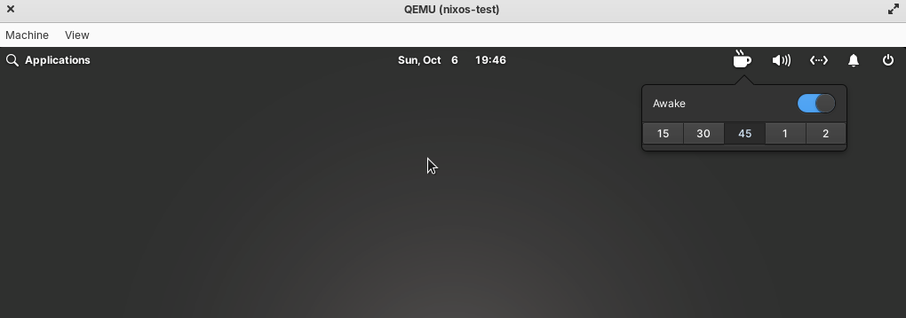

# awake

awake is a native stay-awake system tray indicator for pantheon



## installation

awake uses systemd.

### nix flake

awake is available as a nix flake.

### os-specific binaries

<todo: todo>

### from source

awake is built for pantheon and relies on the vala build chain. This means that you need meson and ninja. The flakefile will have the most up to date dependencies.

- vala
- pkgconfig
- meson
- ninja
- gtk3
- libgee
- pantheon.granite
- pantheon.wingpanel

These dependencies will vary in name dependent on linux flavor and distribution.

Source can be built by running

```
meson setup
cd <builddir>
ninja install
```

## troubleshooting source builds

### nix

nix relies on the git tree path for nix builds. If you make any modifications to the package, ensure that the file is in the git tree.

### uri/resources missing

awake uses gresources and gsettings to provide os-agnostic gtk support instead of relying on hardcoded FHS paths. Icons are compiled directly into the binary.

## testing

Testing can be enabled using the `GTK_DEBUG` variable.

awake inhibitors can be viewed:

```
systemd-inhibit --list
```

## resources

- [https://valadoc.org/glib-2.0/GLib.Process.spawn_async.html](https://valadoc.org/glib-2.0/GLib.Process.spawn_async.html)
- [https://docs.elementary.io/develop/apis/gresource](https://docs.elementary.io/develop/apis/gresource)
- [https://docs.elementary.io/develop/apis/state-saving](https://docs.elementary.io/develop/apis/state-saving)
